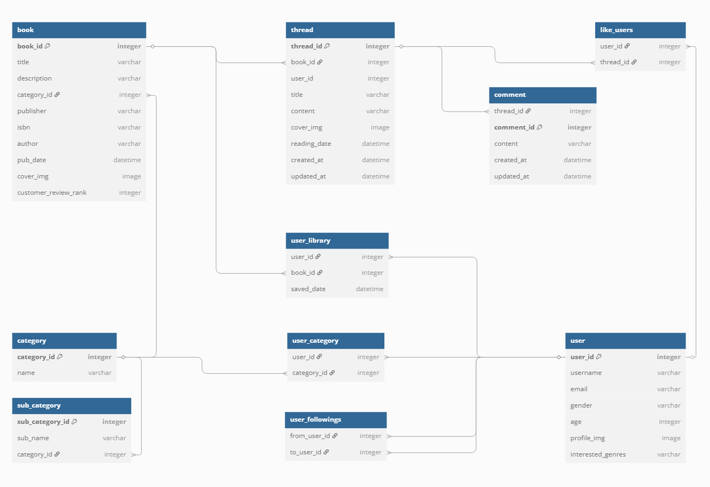
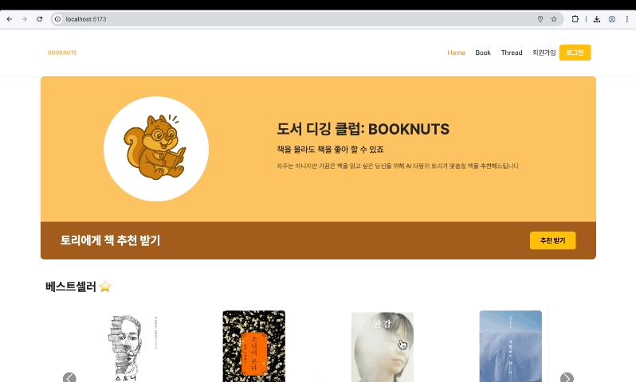
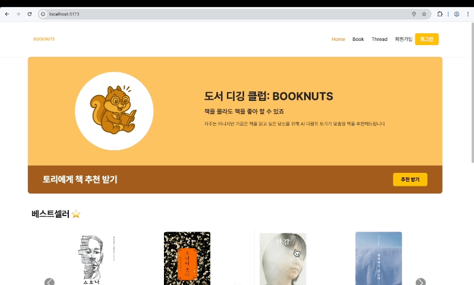

# 🐿️ 도서 디깅 클럽-BOOKNUTS

> “책을 잘 몰라도, 책을 좋아할 수 있죠!”<br/>
AI 기술을 활용한 차세대 개인 맞춤형 도서 추천 웹 서비스
> 
<br/><br/>

## 🗂️ 프로젝트 개요


**도서 디깅 클럽-BOOKNUTS**는 독서·도서에 관심이 있지만 어떤 책을 읽어야 할지 잘 모르겠는 유저에게 쉽게 맞춤형 도서 추천을 제공하는 스마트 독서 플랫폼입니다.

대형 언어 모델(LLM)을 활용하여 기존 검색 방식의 한계를 뛰어넘는 의미 기반 도서 추천 서비스를 제공합니다.

### 📅  프로젝트 정보

- 개발 기간: 2025.05.22.(목) ~ 2025.05.28.(수)
- 프로젝트 목표:
**AI** 기술을 활용해 유저에게 **스마트한 독서 경험**을 제공하는 **도서 추천 플랫폼** 구축


### 👥 팀원 소개

| 이름     | 역할                    | 담당 주요 기능                                      |
|----------|-------------------------|----------------------------------------------------|
| 박수아 (팀장) | Backend, Frontend        | Thread 커뮤니티 서비스, 개인화 서비스, UX           |
| 안다빈      | Backend, Frontend        | 도서 정보 서비스, AI 토리 추천 서비스, UI           |


### 💡 서비스 특징

- 타겟 유저
    - 독서를 시작하고 싶지만 어떤 책을 읽어야 할지 모르는 사람
    - 취향에 맞는 책을 찾고 싶은 독서가
    - 새로운 독서 경험과 커뮤니티 활동에 관심 있는 사용자

<br/><br/>
## 🪄 주요 기능


### 🤖 AI 토리의 도서 추천

- **인터랙티브 맞춤형 추천**: AI 캐릭터 '토리’에게 질문하면 개인화된 추천 도서 정보 제공
- **사용자 요구사항 분석**: 취향, 관심사, 독서 목적 등을 종합 분석하여 추천

### 📚 도서 정보 서비스

- **전체 도서 목록**: 카테고리별 도서 브라우징
- **상세 정보 제공**: 도서 설명, 장르, 저자 소개 등
- **아이템 기반 연관 추천**: 같은 작가/출판사/카테고리 기반 추천
- **통합 도서 검색**: 제목/작가/책 소개 기반 도서 검색

### 🎨 Thread 커뮤니티 서비스

- **독후감 게시판**: 사용자 간 독서 감상 공유
- **생성형 AI DALL-E 3 커버 이미지**: 감상평 기반 4컷 만화 생성
- **댓글 시스템**: 게시글에 대한 댓글 작성/삭제
- **통합 쓰레드 검색**: 책 정보, 쓰레드 내용, 작성자 기반 검색

### 🗺️ 실용적 독서 지원

- **위치 기반 서비스**: 주변 도서관/서점 위치 정보 제공
- **지도 인터페이스**: 직관적인 지도를 통한 독서 공간 탐색

### 👤 개인화 서비스

- **내 서재**: 관심 도서 저장 및 관리
- **마이 프로필**: 사용자 정보, 서재, 작성한 쓰레드 관리
- **회원 인증**: 회원가입/회원정보수정/탈퇴/로그인/로그아웃 기능

<br/><br/>
## 🛠️ 개발 환경 & 기술 스택


### 💛 **Backend**

- **Language**: Python 3.9.
- **Framework**: Django 4.2.16
- **API**: Django REST Framework
- **Database**: SQLite

### **🧡** Frontend

- **Language**: JavaScript
- **Framework**: Vue.js 3.3.13
- **Styling**: CSS3, Bootstrap 5.3.6, Vue 컴포넌트

### 🤖 AI/ML

- **LLM**: GPT-4o-mini (AI 토리 추천 엔진)
- **Image Generation**: DALL-E 3 (커버 이미지 생성)

### 🧞‍♂️ External APIs

- **도서 정보**: 알라딘 API
- **지도/위치**: 구글맵 API

### 🔧 DevOps & Tools

- **Version Control**: Git, GitHub
- **API Testing**: Postman
- **UI/UX Design**: Figma, Relumn
- **Project Management**: Notion

### ⚙️ 시스템 아키텍처

```
┌─────────────────┐    ┌─────────────────┐    ┌─────────────────┐
│   Frontend      │◄──►│   Backend API   │◄──►│   AI Service    │
│   (Vue.js)      │    │   (Django)      │    │   (GPT-4o)      │
└─────────────────┘    └─────────────────┘    └─────────────────┘
                              │                         │
                              ▼                         ▼
                    ┌─────────────────┐    ┌─────────────────┐
                    │     SQLite      │    │  External APIs  │
                    │   (Main DB)     │    │ (Aladin, Google)│
                    └─────────────────┘    └─────────────────┘
```

### 🗃️ ERD

https://dbdiagram.io/d/682d7a67b9f7446da3751613?utm_source=dbdiagram_embed&utm_medium=bottom_open



- 주요 테이블 구조
    
    ### 📚 도서 관련
    
    - **book**: 도서 기본 정보 (제목, 설명, 카테고리, 출판사, ISBN, 저자, 출간일, 커버이미지, 평점)
    - **category**: 도서 카테고리 (대분류)
    - **sub_category**: 도서 하위 카테고리 (소분류)
    
    ### 👥 사용자 관련
    
    - **user**: 사용자 기본 정보 (사용자명, 이메일, 성별, 나이, 프로필이미지, 관심장르)
    - **user_library**: 사용자 서재 (저장한 도서 목록)
    - **user_category**: 사용자-카테고리 관계
    - **user_followings**: 사용자 팔로우 관계
    
    ### 💬 커뮤니티 관련
    
    - **thread**: 독후감 쓰레드 (제목, 내용, 커버이미지, 독서일자)
    - **comment**: 쓰레드 댓글
    - **like_users**: 좋아요 기능
    
    ### 관계도
    
    - 사용자는 여러 도서를 서재에 저장 (1:N)
    - 도서는 여러 쓰레드를 가질 수 있음 (1:N)
    - 사용자는 여러 쓰레드를 작성 (1:N)
    - 쓰레드는 여러 댓글을 가짐 (1:N)
    - 사용자 간 팔로우 관계 (M:N)

### 🖥️ UI/ UX 설계

- UI

[https://embed.figma.com/design/FXHrhI1V8DQ5ZSW75qVRdO/BookNuts?node-id=0-1&p=f&t=qiFg4rNz66qFqXgG-0&embed-host=notion&footer=false&theme=system&embed-host=notion&footer=false&theme=system](https://embed.figma.com/design/FXHrhI1V8DQ5ZSW75qVRdO/BookNuts?node-id=0-1&p=f&t=qiFg4rNz66qFqXgG-0&embed-host=notion&footer=false&theme=system&embed-host=notion&footer=false&theme=system)

- UX

[https://www.relume.io/app/project/P1959633_3ButeH4BUFsvTddKkCTGnUqPIr9fh40iyvH8sb8ga-I#mode=sitemap&view=builder&concept=2g5R38RmauRQMFBMDu1UXr](https://www.relume.io/app/project/P1959633_3ButeH4BUFsvTddKkCTGnUqPIr9fh40iyvH8sb8ga-I#mode=sitemap&view=builder&concept=2g5R38RmauRQMFBMDu1UXr)

### 📂 프로젝트 폴더 구조

- Backend-Django
    
    ```
    09-pjt/
    ├──📁 back/
    	 ├── 📁 accounts/                # 사용자 인증 및 계정 관련 앱
    	 ├── 📁 books/                   # 도서 관련 기능 앱
    	 │   ├── 📁 fixtures/            # 초기 데이터 JSON 파일
    	 │   │   ├── 📄 new_books.json   # 신규 도서 데이터
    	 │   │   ├── 📄 categories.json  # 도서 카테고리 데이터
    	 │   │   └── 📄 threads.json     # 게시글(스레드) 데이터
    	 │   ├── 📄 isbn_keywords.json   # ISBN 기반 키워드 정보
    	 │   ├── 📄 recommendation.py    # 도서 추천 알고리즘
    	 │   └── 📄 utils.py             # books 앱 thread 커버 이미지 생성 함수
    	 ├── 📁 media/                   # 업로드된 사용자 파일 저장 경로
    	 ├── 📁 pjt_booknuts/            # Django 프로젝트 설정 폴더
    	 ├── 📁 static/                  # 정적 파일 (JS, CSS, 이미지 등)
    	 ├── 📄 .env                     # 환경 변수 파일
    	 ├── 📄 .gitignore           
    	 ├── db.sqlite3               # SQLite 데이터베이스 파일
    	 ├── 📄 manage.py              
    	 └── 📄 requirements.txt         # 프로젝트 종속성 목록
    ```
    
- Frontend - Vue.js
    
    ```
    09-pjt/
    └── 📁 front/                             # Vue.js 프론트엔드
            └── 📁 pjt-booknuts/
                ├── 📁 public/                # 정적 자원 (파비콘, 공개 이미지 등)
                ├── 📁 src/                   # 소스 코드 디렉토리
                │   ├── 📁 assets/            # 이미지, CSS 등 정적 리소스
                │   ├── 📁 components/        # 재사용 컴포넌트
                │   ├── 📁 router/            # Vue Router 설정
                │   ├── 📁 stores/            # Pinia/Vuex 등 상태 관리
                │   ├── 📁 views/             # 페이지 단위 Vue 파일
                │   ├── 📄 App.vue            # 최상위 Vue 컴포넌트
                │   └── 📄 main.js            # 앱 진입점 (Vue 앱 초기화)
                ├── 📄 .gitignore                  
                ├── 📄 index.html             # 앱 HTML 템플릿
                ├── 📄 package.json           # 프로젝트 종속성 및 스크립트 정의
                └── 📄 vite.config.js         # Vite 빌드 도구 설정 파일
    ```
    

<br/><br/>
## 🔍 기능 상세 명세서


### 🤖 AI 토리의 도서 추천



- 루트 페이지 내 추천 섹션
- 로그인 없이 이용 가능
- 추천 구조
    - **사용자의 자연어 입력**에서 의미 있는 키워드 → 도서 데이터베이스에서 가장 연관성 높은 책을 추천
    
    | 단계 | 주요 역할 및 기술 요소 |
    | --- | --- |
    | 사용자 입력 | 자연어 쿼리 수집, 유효성 검사 |
    | 키워드 추출 | GPT-4o-mini 활용, 의미 기반 키워드 도출 |
    | 도서 데이터 로드 | ISBN별 키워드/제목 정보 로딩 |
    | 유사도 계산 | 키워드/제목 비교(Sequence Matcher), 점수화 |
    | 상위 도서 선정 | 점수 기준 정렬, 상위 N권 선택 |
    | 결과 반환 | DB 조회, 직렬화, API 응답 |
    - 핵심
        1. AI 기반 의미 분석: GPT를 활용해 사용자의 모호한 요구도 맥락에 맞는 키워드로 변환
        2. 정교한 유사도 평가: 키워드 및 제목을 함께 고려해 도서와의 연관성을 다각도로 평가
        ✨키워드 사전 → 크롤링
        3. 확장성: 키워드 사전, 유사도 함수, 추천 개수 등 다양한 방식으로 커스터마이징 가능
    - 유사도 함수
        1. 사용자 키워드와 도서 키워드 쌍마다 유사도(SequenceMatcher, 0.8 이상)를 측정
        → 일치할 때마다 점수 부여
        2. 사용자 키워드가 도서 제목에 포함되어 있으면 추가 점수 부여

### 📚 도서 정보 서비스


| **단계** | **주요 역할 및 기술 요소** |
| --- | --- |
| 전체 도서 목록 | 데이터베이스 내 모든 도서 조회 및 리스트업 |
| 상세 페이지 | 도서 상세 정보, 관련 쓰레드, 관련 도서 추천, 쓰레드 작성 |
| 검색 | Fuse.js 활용, 제목/작가/소개 기반 퍼지 검색 |
| 관련 도서 추천 | 아이템 기반 필터링(저자→출판사→카테고리), 우선순위 적용 |
| 위치 정보 제공 | 도서관/서점 위치, 지도 기반 탐색 |
- **검색 섹션**
    - 카테고리 기반 토글
    - **Fuse.js** 활용
        - Fuse.js란?
            
            자바스크립트 기반의 경량 퍼지 검색 라이브러리
            입력값과 데이터의 유사도를 계산해 가장 비슷한 결과를 반환합니다.
            오타, 부분 단어, 순서가 달라도 검색이 잘 동작하며,
            사용자가 원하는 도서를 빠르게 찾을 수 있도록 돕습니다.
            
        - Fuse.js는 퍼지(모호한) 검색 알고리즘을 제공하여, 오타나 일부 단어만 입력해도 유사한 결과를 반환함
        - 도서의 제목, 작가, 책 소개 필드를 대상으로 빠르고 직관적인 검색 경험 제공
- **전체 도서 목록**
    - 도서 데이터베이스 내 모든 도서 목록을 게시
    - 각 도서 클릭 시 해당 도서의 상세 페이지로 이동 가능
- **도서 상세 페이지**
    - 도서의 상세 정보(제목, 저자, 출판사, 카테고리, 소개 등) 제공
    - 관련 쓰레드 목록 게시
    - **관련 쓰레드 생성** (로그인 후 가능)
    - 관련 도서 추천 제공
        - **아이템 기반 필터링**
            1. 같은 저자, 같은 출판사, 같은 카테고리 순으로 연관 도서 추천
            2. 우선순위대로 최대 6권까지 추천
    - 주변 독서 공간 탐색 지원
        - Google Maps JavaScript API
        - 유저의 위치 인근 도서관, 서점 정보 제공
        - **지도 인터페이스**

### 🎨 Thread 커뮤니티 서비스


- 로그인 필요
- **전체 Thread 목록**
    - 모든 사용자가 작성한 쓰레드를 최신순 등으로 리스트업
    - 각 쓰레드 클릭 시 상세 페이지로 이동
- **Thread 상세 페이지**
    - 쓰레드의 본문, 작성 시간, 수정 시간 등 상세 정보 제공
    - 해당 쓰레드와 연관된 도서 정보(책 제목, 저자, 표지 등) 표시
    - 쓰레드 작성자의 프로필 확인 및 프로필 페이지로 이동 가능
    - **댓글 기능**
        - 관련 댓글 목록 조회
        - 댓글 작성 및 삭제(작성자 본인만) 가능
    - **좋아요 상호작용 기능**
        - (추후 확장 가능) 리포스트, 공유 등 커뮤니티 활성화 기능 지원
- **검색 섹션**
    - 쓰레드 제목, 쓰레드 본문, 쓰레드 작성자 기준 통합 검색
    - Fuse.js 활용
- **쓰레드 작성/관리**
    - 로그인 유저만 새로운 쓰레드 작성 가능
    - 작성한 쓰레드는 본인만 수정/삭제 가능

### 👤 개인화 서비스



- 로그인 필요
- **프로필 페이지**
    - **사용자 정보**
        - 닉네임, 프로필 이미지, 이메일 등 기본 정보 제공
    - **유저 서재 목록**
        - 사용자가 관심 도서로 등록한 책 목록(내 서재)
        - 각 도서 클릭 시 상세 페이지로 이동
    - **유저가 작성한 쓰레드 목록**
        - 사용자가 작성한 모든 쓰레드(독후감, 감상평 등) 리스트업
        - 각 쓰레드 클릭 시 상세 페이지로 이동
        - 본인이 작성한 쓰레드는 수정/삭제 가능
    - **회원 정보 수정**
        - 닉네임, 프로필 이미지 등 정보 변경 기능
    - **회원 탈퇴**
        - 회원 탈퇴 요청 시 재확인 및 안내 메시지 표시
- **로그인/로그아웃**
    - 로그인 상태에 따라 접근 가능한 서비스(예: 내 서재, 프로필 등) 제어
    - 로그인 실패 시 오류 메시지 및 재입력 안내
    - 로그아웃 시 세션/토큰 만료 처리 및 홈으로 리다이렉트


<br/><br/>
## 🐥 소감


### 🧡 다빈

이번 도서 추천 서비스는 기획부터 구현까지 1학기 동안 배운 내용을 총동원해 만든 첫 프로젝트였습니다.
‘책을 잘 몰라도 읽고 싶게 만드는 경험’을 목표로, 사용자 페르소나 설정부터 추천 알고리즘 설계, UI/UX 구성까지 고민하며 서비스를 구체화했습니다.
특히 GPT API와 크롤링 데이터를 연동해 실제 사용자 취향에 가까운 추천을 구현하면서, 기술적 난관도 많았지만 큰 성장을 경험할 수 있었습니다.

하나의 서비스를 완성하는 데 얼마나 많은 시행착오와 노력이 필요한지 절실히 느꼈고, 무엇보다 혼자였다면 절대 해내지 못했을 일이었습니다.
함께한 수아 언니와의 협업과 아이디어가 큰 힘이 되었고, 그 덕분에 끝까지 완성할 수 있었습니다. 진심으로 고마워요🧡


### 🩵 수아

이번 프로젝트는 짧은 시간 내에 많은 작업을 소화해야 했던 정말 빡센 일정이었고, 목업 툴의 필요성을 절실하게 체감한 경험이었습니다. 
파이썬만 할 줄 알았던 내가 풀스택 웹 개발에 도전하고, 일주일도 안되는 촉박한 시간 내에 완성도 있는 웹 애플리케이션을 구현한다? 올해 1월의 저는 못 믿었을 거에요.
사실 팀원의 덕을 크게 봤습니다. 가장 먼저 목업을 제대로 만들자는 다빈님의 제안이 아니었으면, 제시간 안에 프로젝트를 완성하는 건 불가능했을 것 같습니다. 진심으로 다빈님에게 고마워요!

처음에는 기능이 뼈대고 스타일이 살이라고 생각했지만, 실제 프로젝트를 진행하면서 깨달았습니다. 초반에 스타일과 UI 설계를 잘 해 놓는 것이 프로젝트 완성도를 좌우하는 핵심이라는 것을요.
무엇보다 목업 툴을 잘 다루는 능력이 정말 중요하다는 걸 느꼈습니다. 이미지 한 장만 던져도 생성형 AI가 디자인 코드를 기깔나게 뽑아주는 시대라, 빠르게 스타일을 잡고 그 위에 기능을 입히는 게 더 효율적인 작업 방식이더라구요!

기능에서 자꾸 오류가 발생해서 정말 미안했어요. 이번 프로젝트를 다시 돌아보며, 다음에는 오류를 더 줄일 수 있도록 노력하겠습니다. 팀원들이 저를 믿고 맡길 수 있도록 성장하고 싶어요!
정말 샤라웃 다빈! 감사합니다!
